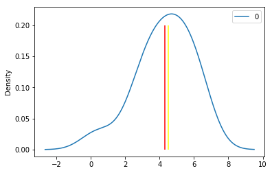
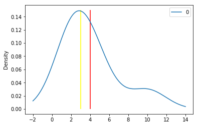
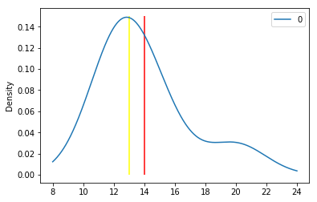

<h3>1. Якщо знайти кореляцію між щорічною кількістю народжених в Голландії дітей Ζ і кількістю прилетілих лелек X, то вона виявиться досить значною. Чи можна на основі цього статистичного результату зробити висновок, що дітей приносять лелеки? </h3>
 

<p>Это может быть неверное утверждение. Для проверки его - нужно проверить правдивая эта корреляция или нет, нужно начать изменять значение 1 переменной и смотреть как меняется другое.
К примеру, если при увеличении кол-ва детей резко уменьшается количество аистов. То это ложная корреляция</p>

<h3>2. Д. Хебб і К. Вільям розробили тест естакадного лабіринту для порівняльної оцінки «Кмітливості» тварин. Він складається з 12 завдань. У наведеній нижче таблиці дані середні числа помилок при виконанні цих завдань щурами, кроликами і кішками (в дужках вказані ранги Qij всередині кожного рядка).</h3>


```python
rat=[1.5,1.1,1.8,1.9,4.3,2,8.4,6.6,2.4,6.5,2.6,6.5]
rabbit=[1.7,1.5,8.1,1.3,4,4.6,4,5.1,2.5,6.9,2.5,6.8]
cat=[0.3,1,3.6,0,0.6,5.5,1,0,0,1.6,4.3,1]
df = pd.DataFrame({
    'Rats': rat,
    'Rabbits': rabbit,
    'Cats': cat,
})
df
```


<div>
<style scoped>
    .dataframe tbody tr th:only-of-type {
        vertical-align: middle;
    }

    .dataframe tbody tr th {
        vertical-align: top;
    }

    .dataframe thead th {
        text-align: right;
    }
</style>
<table border="1" class="dataframe">
  <thead>
    <tr style="text-align: right;">
      <th></th>
      <th>Rats</th>
      <th>Rabbits</th>
      <th>Cats</th>
    </tr>
  </thead>
  <tbody>
    <tr>
      <th>0</th>
      <td>1.5</td>
      <td>1.7</td>
      <td>0.3</td>
    </tr>
    <tr>
      <th>1</th>
      <td>1.1</td>
      <td>1.5</td>
      <td>1.0</td>
    </tr>
    <tr>
      <th>2</th>
      <td>1.8</td>
      <td>8.1</td>
      <td>3.6</td>
    </tr>
    <tr>
      <th>3</th>
      <td>1.9</td>
      <td>1.3</td>
      <td>0.0</td>
    </tr>
    <tr>
      <th>4</th>
      <td>4.3</td>
      <td>4.0</td>
      <td>0.6</td>
    </tr>
    <tr>
      <th>5</th>
      <td>2.0</td>
      <td>4.6</td>
      <td>5.5</td>
    </tr>
    <tr>
      <th>6</th>
      <td>8.4</td>
      <td>4.0</td>
      <td>1.0</td>
    </tr>
    <tr>
      <th>7</th>
      <td>6.6</td>
      <td>5.1</td>
      <td>0.0</td>
    </tr>
    <tr>
      <th>8</th>
      <td>2.4</td>
      <td>2.5</td>
      <td>0.0</td>
    </tr>
    <tr>
      <th>9</th>
      <td>6.5</td>
      <td>6.9</td>
      <td>1.6</td>
    </tr>
    <tr>
      <th>10</th>
      <td>2.6</td>
      <td>2.5</td>
      <td>4.3</td>
    </tr>
    <tr>
      <th>11</th>
      <td>6.5</td>
      <td>6.8</td>
      <td>1.0</td>
    </tr>
  </tbody>
</table>
</div>


```python
rat=pd.DataFrame(rat)
rabbit=pd.DataFrame(rabbit)
cat=pd.DataFrame(cat)
rat. describe()
```


<div>
<style scoped>
    .dataframe tbody tr th:only-of-type {
        vertical-align: middle;
    }

    .dataframe tbody tr th {
        vertical-align: top;
    }

    .dataframe thead th {
        text-align: right;
    }
</style>
<table border="1" class="dataframe">
  <thead>
    <tr style="text-align: right;">
      <th></th>
      <th>0</th>
    </tr>
  </thead>
  <tbody>
    <tr>
      <th>count</th>
      <td>12.000000</td>
    </tr>
    <tr>
      <th>mean</th>
      <td>3.800000</td>
    </tr>
    <tr>
      <th>std</th>
      <td>2.534489</td>
    </tr>
    <tr>
      <th>min</th>
      <td>1.100000</td>
    </tr>
    <tr>
      <th>25%</th>
      <td>1.875000</td>
    </tr>
    <tr>
      <th>50%</th>
      <td>2.500000</td>
    </tr>
    <tr>
      <th>75%</th>
      <td>6.500000</td>
    </tr>
    <tr>
      <th>max</th>
      <td>8.400000</td>
    </tr>
  </tbody>
</table>
</div>


```python
rabbit. describe()

```


<div>
<style scoped>
    .dataframe tbody tr th:only-of-type {
        vertical-align: middle;
    }

    .dataframe tbody tr th {
        vertical-align: top;
    }

    .dataframe thead th {
        text-align: right;
    }
</style>
<table border="1" class="dataframe">
  <thead>
    <tr style="text-align: right;">
      <th></th>
      <th>0</th>
    </tr>
  </thead>
  <tbody>
    <tr>
      <th>count</th>
      <td>12.000000</td>
    </tr>
    <tr>
      <th>mean</th>
      <td>4.083333</td>
    </tr>
    <tr>
      <th>std</th>
      <td>2.293799</td>
    </tr>
    <tr>
      <th>min</th>
      <td>1.300000</td>
    </tr>
    <tr>
      <th>25%</th>
      <td>2.300000</td>
    </tr>
    <tr>
      <th>50%</th>
      <td>4.000000</td>
    </tr>
    <tr>
      <th>75%</th>
      <td>5.525000</td>
    </tr>
    <tr>
      <th>max</th>
      <td>8.100000</td>
    </tr>
  </tbody>
</table>
</div>


```python
cat. describe()
```


<div>
<style scoped>
    .dataframe tbody tr th:only-of-type {
        vertical-align: middle;
    }

    .dataframe tbody tr th {
        vertical-align: top;
    }

    .dataframe thead th {
        text-align: right;
    }
</style>
<table border="1" class="dataframe">
  <thead>
    <tr style="text-align: right;">
      <th></th>
      <th>0</th>
    </tr>
  </thead>
  <tbody>
    <tr>
      <th>count</th>
      <td>12.000000</td>
    </tr>
    <tr>
      <th>mean</th>
      <td>1.575000</td>
    </tr>
    <tr>
      <th>std</th>
      <td>1.857234</td>
    </tr>
    <tr>
      <th>min</th>
      <td>0.000000</td>
    </tr>
    <tr>
      <th>25%</th>
      <td>0.225000</td>
    </tr>
    <tr>
      <th>50%</th>
      <td>1.000000</td>
    </tr>
    <tr>
      <th>75%</th>
      <td>2.100000</td>
    </tr>
    <tr>
      <th>max</th>
      <td>5.500000</td>
    </tr>
  </tbody>
</table>
</div>


Коты очень сильно отличаются от крыс и кроликов

<h3>3. Ринкова ціна акцій компанії Microsoft Corporation в листопаді 2002 року зросла на 7,88%, а в грудні - впала на 10,3%. 
</h3>
    1. Обчисліть середнє арифметичне значення норми прибутку.<br>
    2. Обчисліть середнє геометричне значення норми прибутку. <br>
    3. Поясніть різницю між цими результатами<br>


```python

```

<h3>4.  У 2000-2002 рр. вартість акцій сильно коливалася. У наступній таблиці наведено індекси Dow Jones Industrial Index, Standard & Poor 500, Russell 2000 і Wilshire 5000 за цей період.</h3>


<table>
    <tr><th>Рік</th><th>DJIA</th><th>SP500</th><th>Russel2000</th><th>Wilshire5000</th></tr>
    <tr><td>2002</td><td>-15,01</td><td>-22,1</td><td>-21,58</td><td>-20,90</td></tr>
    <tr><td>2001</td><td>-5,44</td><td>-11,9</td><td>-1,03</td><td>-10,97</td></tr>
    <tr><td>2000</td><td>-6,20</td><td>-9,1</td><td>-3,02</td><td>-10,89</td></tr>
</table>
 

1. Обчисліть середнє геометричне значення норми прибутку для індексу DJIA. 
2. Обчисліть середнє геометричне значення норми прибутку для індексу SP500. 
3. Обчисліть середнє геометричне значення норми прибутку для індексу Russel2000. 
4. Обчисліть середнє геометричне значення норми прибутку для індексу Wilshire5000.


```python
import pandas as pd
import numpy as np
import scipy as sc
import seaborn as sb
import statistics as stat
import matplotlib.pyplot as plt

djia = [15.01,5.44,6.2]
sp500 = [22.1,11.9,9.1]
russel2000 = [21.58,1.03,3.02]
wilshire5000 = [20.9,10.97,10.89]
years = [2002,2001,2000]
```


```python
df = pd.DataFrame({
    'Year': years,
    'DJIA': djia,
    'SP500': sp500,
    'Russel2000': russel2000,
    'Wilshire5000':wilshire5000
})

df
```


<div>
<style scoped>
    .dataframe tbody tr th:only-of-type {
        vertical-align: middle;
    }

    .dataframe tbody tr th {
        vertical-align: top;
    }

    .dataframe thead th {
        text-align: right;
    }
</style>
<table border="1" class="dataframe">
  <thead>
    <tr style="text-align: right;">
      <th></th>
      <th>Year</th>
      <th>DJIA</th>
      <th>SP500</th>
      <th>Russel2000</th>
      <th>Wilshire5000</th>
    </tr>
  </thead>
  <tbody>
    <tr>
      <th>0</th>
      <td>2002</td>
      <td>15.01</td>
      <td>22.1</td>
      <td>21.58</td>
      <td>20.90</td>
    </tr>
    <tr>
      <th>1</th>
      <td>2001</td>
      <td>5.44</td>
      <td>11.9</td>
      <td>1.03</td>
      <td>10.97</td>
    </tr>
    <tr>
      <th>2</th>
      <td>2000</td>
      <td>6.20</td>
      <td>9.1</td>
      <td>3.02</td>
      <td>10.89</td>
    </tr>
  </tbody>
</table>
</div>


```python
sc.stats.gmean(df)
```


    array([2000.99983342,    7.96997747,   13.37601896,    4.06410765,
             13.56626401])


<h3>5. Філія банку, розташована в промисловому районі міста, прагне підвищити якість обслуговування клієнтів під час обіду, з 12:00 до 13:00. Протягом тижня співробітники записували час очікування клієнтів, що стоять в черзі протягом обідньої перерви (кількість хвилин, що пройшли від моменту, коли клієнт переступив поріг філії, до моменту його обслуговування). Для оцінки ефективності обслуговування створена вибірка, що містить дані про час очікування 15 клієнтів. (оцінюється у 2 бали)</h3><br>
1. Обчисліть середнє арифметичне, медіану, перший і третій квартиль. <br>
2. Обчисліть дисперсію, стандартне відхилення, розмах, межквартільний розмах і коефіцієнт варіації. <br>
3. Чи є розподіл даних асиметричним? Якщо так, чому? <br>
4. Коли клієнт приходить в банк під час обідньої перерви, він зазвичай запитує менеджера, скільки часу йому доведеться стояти в черзі. Менеджер відповідає: "Майже напевно, не більш як 5 хвилин". Чи правий менеджер? <br>
5. Припустимо, що менеджер хотів би гарантувати певний рівень обслуговування клієнтів протягом обідньої перерви. Несвоєчасне обслуговування клієнта може компенсуватися невеликим винагородою за терпіння або іншим подарунком. Як вибрати оптимальний межа часу, після якого клієнту належить компенсація? Обгрунтуйте свою відповідь. <br>
 4,21  5,55  3,02  5,13  4,77  2,34  3,54  3,20  4,50  6,10  0,38  5,12  6,46  6,19  3,79 


```python
dds = [4.21, 5.55, 3.02, 5.13, 4.77, 2.34, 3.54, 3.20, 4.50, 6.10, 0.38, 5.12, 6.46, 6.19, 3.79]
```


```python
df = pd.DataFrame(dds)
```


```python
print('Mean: ', df.mean())
print('Median: ', df.median())
print('Quartile 1:', np.percentile(df,25))
print('Quartile 3:', np.percentile(df,75))
print('Inquartile range:',np.percentile(df,75)-np.percentile(df,25))
print('Dispersio:', stat.variance(dds))
print('Standart deviation:', df.std())
print('Coefficient of variation:', df.std()/df.mean())
```

    Mean:  0    4.286667
    dtype: float64
    Median:  0    4.5
    dtype: float64
    Quartile 1: 3.37
    Quartile 3: 5.34
    Inquartile range: 1.9699999999999998
    Dispersio: 2.682995238095238
    Standart deviation: 0    1.637985
    dtype: float64
    Coefficient of variation: 0    0.382112
    dtype: float64
    


```python
df.plot(kind="Density")
plt.vlines(df.mean(),
           ymin=0,
           ymax=.2,
          color="red")
plt.vlines(df.median(),
           ymin=0,
           ymax=.2,
          color="yellow")
```


    <matplotlib.collections.LineCollection at 0x1ba78a7dda0>





<p>На графике можно видеть левосторонюю асимметрию, вершина графика немног смещена вправо.</p>

Среднее время ожидания клиента равняется: 4. Из этого следует, что 4 утверждение - верное

Оптивальное время для вознаграждения клиента - 3 квартиль. Ниже из таблицы можно увидеть - почему это так.


```python
print('Quartile 1:', np.percentile(df,25))
print('Quartile 2:', np.percentile(df,50))
print('Quartile 3:', np.percentile(df,75))
print('Quartile 4:', np.percentile(df,100))
```

    Quartile 1: 3.37
    Quartile 2: 4.5
    Quartile 3: 5.34
    Quartile 4: 6.46
    

<h3>6. Компанія розробляє програмне забезпечення для управління мережами на основі повторного використання програмного забезпечення. Інакше кажучи, компанія не розробляє нові проекти з нуля, а замість цього на протязі 10 років підтримує базу даних, в якій зберігаються записи про повторно використовуваних компонентах, загальний обсяг яких досягає 2 000 000 рядків коду. Вісім аналітиків компанії отримали завдання оцінити ступінь повторного використання компонентів при розробці нового програмного забезпечення. У наступній таблиці наведено процентні частки повторно використовуваного коду в новому програмному забезпеченні</h3><br>
1. Обчисліть середнє арифметичне, медіану і моду. <br> 
2. Обчисліть розмах, дисперсію і стандартне відхилення.<br> 
3. Дайте інтерпретацію сумарних показників, обчислених при виконанні завдань 1 і 2.


```python
qw=[50,  62.5,  37.5,  75.0,  45.0,  47.5,  15.0,  25.0]
```


```python
df=pd.DataFrame(qw)
```


```python
print('Mean: ', df.mean())
print('Median: ', df.median())
print('Mode: ', df.mode())

```

    Mean:  0    44.6875
    dtype: float64
    Median:  0    46.25
    dtype: float64
    Mode:        0
    0  15.0
    1  25.0
    2  37.5
    3  45.0
    4  47.5
    5  50.0
    6  62.5
    7  75.0
    


```python
print('Dispersio: ', stat.variance(qw))
print('Standart deviation: ', df.std())
print('Inquartile range: ', np.percentile(df,75)-np.percentile(df,25))
```

    Dispersio:  370.42410714285717
    Standart deviation:  0    19.246405
    dtype: float64
    Inquartile range:  18.75
    

<h3>7. Нижче наведено дві вибірки чисел, що мають обсяг n = 7:</h3>


```python
n1=[10, 2, 3, 2, 4, 2, 5]
n2=[20, 12, 13, 12, 14, 12, 15]
```

1. Для кожної вибірки обчисліть вибіркове середнє, медіану і моду. <br>
2. Порівняйте результати і сформулюйте висновки. <br>
3. попарно порівняйте перші, другі та наступні елементи кожної вибірки. Коротко викладіть ваші висновки, враховуючи результати, отримані при вирішенні задачі 2. <br>
4. Обчисліть розмах, межквартільний розмах, вибіркову дисперсію, стандартне відхилення і коефіцієнт варіації кожної вибірки. <br>
5. Опишіть форму розподілу даних в кожній з вибірок. <br>
6. Порівняйте результати вирішення завдань 4 і 5. Сформулюйте висновки. <br>
7. Використовуючи результати вирішення завдань 1-5, вкажіть властивості середнього значення, дисперсії і розподілу даних, що містяться в кожній з вибірок. 


```python
n1=pd.DataFrame(n1)
n2=pd.DataFrame(n2)

print("Mean 1:", n1.mean())
print("Median 1:", n1.median())
print("Mode 1:", n1.mode())
print("----------------------------------")
print("Mean 2:", n2.mean())
print("Median 2:", n2.median())
print("Mode 2:", n2.mode())
```

    Mean 1: 0    4.0
    dtype: float64
    Median 1: 0    3.0
    dtype: float64
    Mode 1:    0
    0  2
    ----------------------------------
    Mean 2: 0    14.0
    dtype: float64
    Median 2: 0    13.0
    dtype: float64
    Mode 2:     0
    0  12
    

<h4>Выборки существенно отличабтся друг от друга, все основные значения описывающие выборку отличабтся друг от друга на 10. Стандартное отклонение у обоих выборок одинаковый</h4>


```python
n1.describe()
```


<div>
<style scoped>
    .dataframe tbody tr th:only-of-type {
        vertical-align: middle;
    }

    .dataframe tbody tr th {
        vertical-align: top;
    }

    .dataframe thead th {
        text-align: right;
    }
</style>
<table border="1" class="dataframe">
  <thead>
    <tr style="text-align: right;">
      <th></th>
      <th>0</th>
    </tr>
  </thead>
  <tbody>
    <tr>
      <th>count</th>
      <td>7.000000</td>
    </tr>
    <tr>
      <th>mean</th>
      <td>4.000000</td>
    </tr>
    <tr>
      <th>std</th>
      <td>2.886751</td>
    </tr>
    <tr>
      <th>min</th>
      <td>2.000000</td>
    </tr>
    <tr>
      <th>25%</th>
      <td>2.000000</td>
    </tr>
    <tr>
      <th>50%</th>
      <td>3.000000</td>
    </tr>
    <tr>
      <th>75%</th>
      <td>4.500000</td>
    </tr>
    <tr>
      <th>max</th>
      <td>10.000000</td>
    </tr>
  </tbody>
</table>
</div>


```python
n2.describe()
```


<div>
<style scoped>
    .dataframe tbody tr th:only-of-type {
        vertical-align: middle;
    }

    .dataframe tbody tr th {
        vertical-align: top;
    }

    .dataframe thead th {
        text-align: right;
    }
</style>
<table border="1" class="dataframe">
  <thead>
    <tr style="text-align: right;">
      <th></th>
      <th>0</th>
    </tr>
  </thead>
  <tbody>
    <tr>
      <th>count</th>
      <td>7.000000</td>
    </tr>
    <tr>
      <th>mean</th>
      <td>14.000000</td>
    </tr>
    <tr>
      <th>std</th>
      <td>2.886751</td>
    </tr>
    <tr>
      <th>min</th>
      <td>12.000000</td>
    </tr>
    <tr>
      <th>25%</th>
      <td>12.000000</td>
    </tr>
    <tr>
      <th>50%</th>
      <td>13.000000</td>
    </tr>
    <tr>
      <th>75%</th>
      <td>14.500000</td>
    </tr>
    <tr>
      <th>max</th>
      <td>20.000000</td>
    </tr>
  </tbody>
</table>
</div>


```python
print('Inquartile range for n1: ', n1.std()/n1.mean())
print('Inquartile range for n2: ', n2.std()/n2.mean())
```

    Inquartile range for n1:  0    0.721688
    dtype: float64
    Inquartile range for n2:  0    0.206197
    dtype: float64
    


```python
n1.plot(kind='Density')
plt.vlines(n1.mean(),
           ymin=0,
           ymax=.15,
          color="red")
plt.vlines(n1.median(),
           ymin=0,
           ymax=.15,
          color="yellow")
```


    <matplotlib.collections.LineCollection at 0x1ba7a2414e0>





```python
n2.plot(kind='Density')
plt.vlines(n2.mean(),
           ymin=0,
           ymax=.15,
          color="red")
plt.vlines(n2.median(),
           ymin=0,
           ymax=.15,
          color="yellow")
```


    <matplotlib.collections.LineCollection at 0x1ba7a36ac88>





<h4>Распределение на обоих графиках одинаковое, смещенное в лево, а значит - наблюдается правосторонняя асимметрия</h4>

<h3>8. Керуючий шинним заводом бажає порівняти реальний внутрішній діаметр двох сортів шин, кожен з яких повинен бути рівним 575 мм. Для оцінки були обрані по п'ять шин кожного сорту. Результати вимірювання їх внутрішніх діаметрів, впорядковані по зростанню, наведені нижче. (оцінюється у 2 бали). </h3>


```python
s1=[568,570,575,578,584]
s2=[573,574,575,577,578]

s1=pd.DataFrame(s1)
s2=pd.DataFrame(s2)
```

1. Для кожного сорту шин обчисліть вибіркове середнє, медіану і моду. <br>
2. Який сорт шин має більш високу якість? Чому? <br>
3. Яким був би ваш відповідь, якби останнім елементом вибірки У було число 588, а не 578? Обгрунтуйте свою відповідь. 


```python
print("Mean 1:", s1.mean())
print("Median 1:", s1.median())
print("Mode 1:", s1.mode())
```

    Mean 1: 0    575.0
    dtype: float64
    Median 1: 0    575.0
    dtype: float64
    Mode 1:      0
    0  568
    1  570
    2  575
    3  578
    4  584
    


```python
print("Mean 1:", s2.mean())
print("Median 1:", s2.median())
print("Mode 1:", s2.mode())
```

    Mean 1: 0    575.4
    dtype: float64
    Median 1: 0    575.0
    dtype: float64
    Mode 1:      0
    0  573
    1  574
    2  575
    3  577
    4  578
    

<h4>Если принять за наилучшее качество - максимальное соответствие шин к 575 мм.(То как и задумывалось). То шини с наилучшим качеством удут те, где отклонение минимальное.<br>
Как видно из данных ниже - 2 шина умеет лучшшее качество</h4>


```python
print('Quality 1: ', s1.std())
print('Quality 2: ', s2.std())
```

    Quality 1:  0    6.403124
    dtype: float64
    Quality 2:  0    2.073644
    dtype: float64
    

<h4>Какая шина будет иметь лучшее качество если заменить последнее значение в выборке</h4>


```python
s3=[568,570,575,578,584]
s4=[573,574,575,577,588]

s3=pd.DataFrame(s3)
s4=pd.DataFrame(s4)

print('Quality 1: ', s3.std())
print('Quality 2: ', s4.std())
```

    Quality 1:  0    6.403124
    dtype: float64
    Quality 2:  0    6.107373
    dtype: float64
    

<h4>Втора шина все еще ближе к идеалу</h4>

<h1>ABC and XYZ analysis</h1>


```python
import pandas as pd
df = pd.read_csv('C:/sc.csv')
```


```python
df.head()
```


<div>
<style scoped>
    .dataframe tbody tr th:only-of-type {
        vertical-align: middle;
    }

    .dataframe tbody tr th {
        vertical-align: top;
    }

    .dataframe thead th {
        text-align: right;
    }
</style>
<table border="1" class="dataframe">
  <thead>
    <tr style="text-align: right;">
      <th></th>
      <th>Rank</th>
      <th>Name</th>
      <th>Platform</th>
      <th>Year</th>
      <th>Genre</th>
      <th>Publisher</th>
      <th>NA_Sales</th>
      <th>EU_Sales</th>
      <th>JP_Sales</th>
      <th>Other_Sales</th>
      <th>Global_Sales</th>
    </tr>
  </thead>
  <tbody>
    <tr>
      <th>0</th>
      <td>1</td>
      <td>Wii Sports</td>
      <td>Wii</td>
      <td>2006.0</td>
      <td>Sports</td>
      <td>Nintendo</td>
      <td>41.49</td>
      <td>29.02</td>
      <td>3.77</td>
      <td>8.46</td>
      <td>82.74</td>
    </tr>
    <tr>
      <th>1</th>
      <td>2</td>
      <td>Super Mario Bros.</td>
      <td>NES</td>
      <td>1985.0</td>
      <td>Platform</td>
      <td>Nintendo</td>
      <td>29.08</td>
      <td>3.58</td>
      <td>6.81</td>
      <td>0.77</td>
      <td>40.24</td>
    </tr>
    <tr>
      <th>2</th>
      <td>3</td>
      <td>Mario Kart Wii</td>
      <td>Wii</td>
      <td>2008.0</td>
      <td>Racing</td>
      <td>Nintendo</td>
      <td>15.85</td>
      <td>12.88</td>
      <td>3.79</td>
      <td>3.31</td>
      <td>35.82</td>
    </tr>
    <tr>
      <th>3</th>
      <td>4</td>
      <td>Wii Sports Resort</td>
      <td>Wii</td>
      <td>2009.0</td>
      <td>Sports</td>
      <td>Nintendo</td>
      <td>15.75</td>
      <td>11.01</td>
      <td>3.28</td>
      <td>2.96</td>
      <td>33.00</td>
    </tr>
    <tr>
      <th>4</th>
      <td>5</td>
      <td>Pokemon Red/Pokemon Blue</td>
      <td>GB</td>
      <td>1996.0</td>
      <td>Role-Playing</td>
      <td>Nintendo</td>
      <td>11.27</td>
      <td>8.89</td>
      <td>10.22</td>
      <td>1.00</td>
      <td>31.37</td>
    </tr>
  </tbody>
</table>
</div>


```python

```
